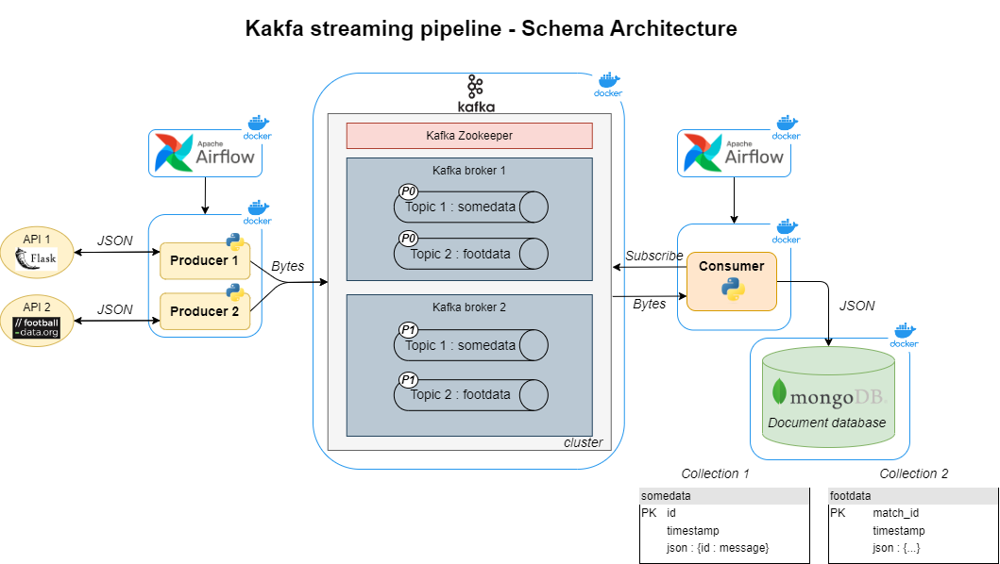

# Learn the basics about Kafka streaming pipelines 🚀

</br>
<p align="center"></p>
</br>

This project is a robust and scalable **streaming data pipeline** that seamlessly integrates data from 2 diverse sources - an external API and a FlaskAPI. The pipeline leverages the power of **Apache Kafka**, utilizing a cluster with 2 brokers and 1 Zookeeper manager, to create a highly efficient and fault-tolerant data transportation system.
</br>

🌐 **Sources**:
* External API: We fetch real-time data from an external API, ensuring that we are always up-to-date with the latest information.
* FlaskAPI: Our custom FlaskAPI provides an interface for real-time user interactions, enriching the data stream with user-generated content.
</br>

🔗 **Kafka Cluster**:
Our Kafka cluster consists of *2 brokers*, working in harmony thanks to *Zookeeper* to ensure data continuity and reliability. This robust architecture guarantees that data is never lost and is efficiently distributed to consumers.
</br>

🎯 **Topics**:
Two distinct Kafka topics are created (somedata and footdata), each corresponding to a specific data source. These topics serve as the central channels through which data flows in our pipeline.
</br>

🧩 **Producers**:
To populate these topics, we have 2 dedicated producers. One continuously queries the external API, while the other responds to user requests through our FlaskAPI. These producers are the heart of our real-time data ingestion process.
</br>

🔍 **Consumer**:
Our consumer subscribes to both Kafka topics, adeptly handling the incoming data streams. It meticulously processes and filters the data before depositing it into a MongoDB database. This final destination ensures that valuable insights can be extracted and analyzed.
</br>

📈 **Scalability and Performance**:
Our pipeline is designed for scalability, making it suitable for handling vast amounts of data. The Kafka cluster's distributed architecture allows us to effortlessly scale to meet growing demands while maintaining high performance.
</br>

## Table of Contents

- [Prerequisites](#prerequisites)
- [Project structure](#project-structure)
- [Setup](#setup)
- [CI/CD Pipeline](#cicd-pipeline)
- [API Reference](#api-reference)
- [Lessons learned](#lessons-learned)
- [Next steps](#next-steps)

## Prerequisites

Before you begin, ensure you have met the following requirements:

- [Python](https://www.python.org/downloads/) (3.10 or higher)
- [Docker](https://www.docker.com/products/docker-desktop)
- [GitHub account](https://github.com/)

<hr>

## Project structure
<!--  -->

- `producer` : containes the FLask API as well as the 2 producers python scripts and a Dockerfile to create the Docker container
- `consumer` : contains the consumer python script and a Dockerfile to create the Docker container
- `airflow` : contains the DAG

<hr>

## Setup
1. Clone the git repository then go to the root directory :

   ```bash
   git clone https://github.com/Stephd91/Kafka_Pipeline.git
   cd Kafka_Pipeline
   ```
2. 

**Docker Compose up to continue your local dev**\
1. Open the `docker-compose.yaml` file (placed at the root directory)
2. Verify the environment variables if necessary
3. At the root directory, create a "db" directory and place a *password.txt* file inside that will hold the MongoDB password to allwo Docker Compose to run the postgres container

```bash
  mkdir db && cd db
  echo "yourpassword" > password.txt
  docker compose up --build
```

Verify the deployment by navigating to ...
<hr>

## CI/CD Pipeline

<hr>

## API Reference

#### "/somedata" route

```http
  GET /somedata/<any string>
```

#### "/footdata" route
```http
  GET /footdata
```
<hr>

## Lessons Learned
With this streaming data pipeline, we have a sophisticated and efficient system for seamlessly integrating data from diverse sources. It ensures data integrity, reliability, and real-time processing.
Here are the skills I have learned from this project :
* 📌 **Kafka**:
  * ✅ Kafka architecture (cluster manager, brokers, topics, partitions, replications, ...)
  * ✅ How a streaming workflow operates with its event sources, producers and consumers
* 📌 **Python & API** :
  * ✅ FlaskAPI
  * ✅ Data serialization and deserialization
* 📌 **Deployment** :
  * ✅ Use multiple containers, networks and volumes in a Docker compose architecture
  * ✅ Dockerization and Docker Compose for multi containers app
  <!-- * ✅ CI/CD pipeline with GitHub Actions -->

<hr>

## Next steps
For the next steps in this project, these functionnalities could be developed:
* 